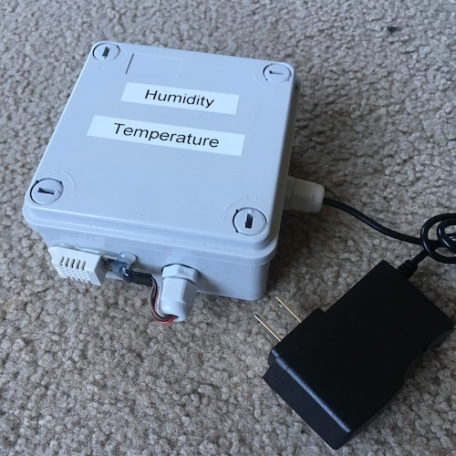

# Humidity-Temperature-Sunset
Particle Photon app to sense humidity and temperature, plus calculate sunset time for partner smart-switch app.
See [Partner app](https://github.com/gallingern/Smart-Switch) for smart switch functionality.

## Overview

This is the partner app to my smart switch project.  It senses humidity and temperature and sends them through the Particle Cloud to my smart switch.  It also calculates sunset time because the library was too large to fit in memory on the smart switch Photon.

## Implementation

Particle variables
* Temperature
* Sunset time

Functions
* Get temp and humidity
* Calculate heat index
* Calculate Sunset
* Publish particle variables

## Parts

* Enclosure
* Particle Photon
* DHTTYPE  AM2302 temperature humidity sensor
